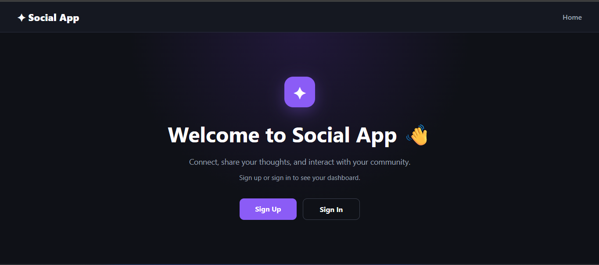

# Loop1y

## Description

Loop1y is a social media application where users can create, view, edit, and delete posts and interact with other users through comments.

The app was built as Project 3 to practice building a full-stack application with a React frontend and Django REST Framework backend. Users can create an account, sign in, create posts, update or delete their posts, and add, edit, or delete comments.

## Getting Started

### Deployed App

[View the deployed Hoots app](https://loop1y.netlify.app/)

### Planning Materials

[Trello Planning Board](https://trello.com/b/rVYp2WLu/full-stack-crud-unit-3)

### Back-End Repository

[Hoots Back-End Repository](https://github.com/Zuhair05/express-social-media-app-back-end)

## Technologies Used

### Front-End

- React
- JavaScript
- CSS
- React Router

### Back-End
The backend for Loop1y is built using Node.js, Express, MongoDB, and Mongoose.

### Development Tools

- GitHub
- Trello
- Render

## Features

- User registration and authentication
- User login and logout
- Create posts
- View posts
- Edit posts
- Delete posts
- Add comments
- Edit comments
- Delete comments
- View post details

## Next Steps

Future enhancements for Loop1y include:

- User profile pages
- Profile pictures
- Like and unlike functionality
- Follow and unfollow users
- Image uploads for posts
- Search functionality
- Notifications
- Improved mobile responsiveness
